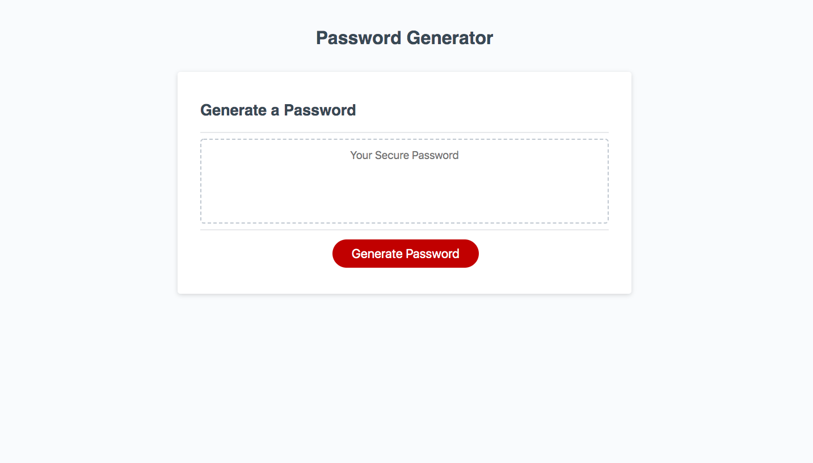

 # Random Password Generator
  

 ## Description
 We had to create a random password generator using javascript. When selected, the random password generator gives the user prompts to choose from and then generates a random password based off of the users input.

## github
Github.com/BrianLevin

## email
bml201095@gmail.com

## contributing

That they can generate all sorts of secure random passwords!

## Deployed Application:

 
 
