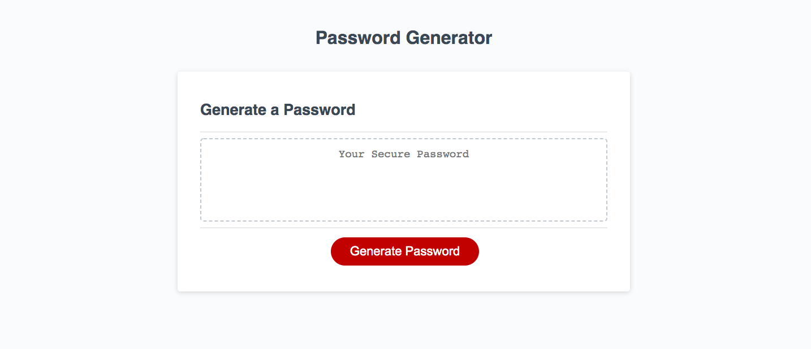

 # Random Password Generator
  This is a  random password generator using javascript. When selected, the random password generator gives the user prompts to choose from and then generates a random password based off of the users input. 
 
 
 ## Click [here](https://brianlevin.github.io/Brian-Levin-Homework-3/) for the live app.  
  

This is the home page:

The first prompt will ask for how many characters you want in your password:

The second prompt will ask if the user wants to have special characters in their password:

The third prompt will ask if the user wants to have numeric characters in their password:

The fouth prompt will ask if the user wants to have any lower case letters in their password:

the fifth prompt will ask if the user wants to have any upper case letters in their password:

.

The users random password is then generated:

## email
bml201095@gmail.com

## Libraries and framewprks:

- Html
 - Css
 - Javascript
 

 
 
